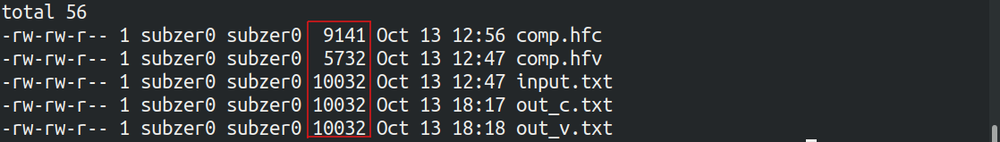

# huffman
This repo is an implementation of both constant and variable huffman encoding.

## Compilation
```
make
```

## Running

Run the following for constant length huffman encoding
```
./huffman_c
```

Run the following for variable length huffman encoding
```
./huffman_v
```

## Example


Sample output

**input.txt**: This is a large text file with random lines of text<br>
**comp.hfv**: This is the variable length huffman encoding of input.txt<br>
**comp.hfc**: This is the constant length huffman encoding of input.txt<br>
**out_c.txt**: This is the uncompressed file generated from comp.hfc<br>
**out_v.txt**: This is the uncompressed file generated from comp.hfv<br>

## Conclusion

It can be observed this is a lossless compression algorithm. The file size of the compressed files 
can be reduced by using a more space efficient way to store the encoding table/tree.<br>

## Explanation

The encoding table is separated from the encoded text by the following character: **\#**. Every encoding 
table has one extra character other than those found in the text: **\0**. This is to ensure that while decoding, 
there is a known ending to the file. Since \0 is not a printable character, it can never be inputed as a character.

